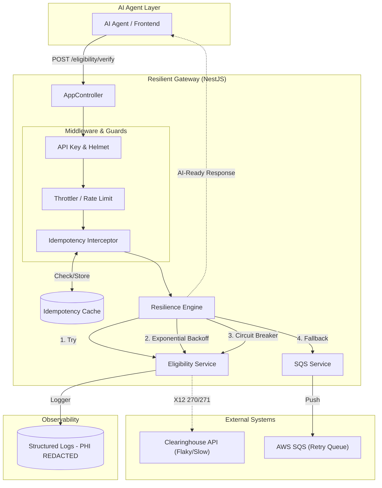

# Resilient RCM Eligibility Gateway

A production-grade microservice designed for **Revenue Cycle Management (RCM)**, providing a resilient, secure bridge between AI Agents and flaky external Clearinghouse APIs (e.g., Availity, Change Healthcare).

## Architecture Diagram



## Production-Grade Features

### Security and Compliance
- **PHI Redaction**: Automatic scrubbing of patient information (e.g., `patient_name`) from all system logs to ensure HIPAA compliance.
- **API Security**: Guarded by `x-api-key` and **Helmet** security headers.
- **Input Validation**: Strict DTO validation using `class-validator` to prevent malformed injections.

### Reliability and Performance
- **Circuit Breaker**: Instrumented with `opossum` to prevent system exhaustion during downstream outages.
- **Exponential Backoff**: RxJS-powered intelligent retries for transient network errors.
- **Rate Limiting**: Protects downstream clearinghouses from AI Agent "loops" or spikes (10 req/min limit).
- **Idempotency**: `x-idempotency-key` support via local cache to prevent duplicate RCM transactions.

### Resilience Fallback
- **Asynchronous Souring**: Failed or timed-out requests are automatically spooled to **AWS SQS**, ensuring zero data loss.
- **AI-Optimized JSON**: Returns standardized responses allowing AI Agents to handle background states gracefully.

## Getting Started

### 1. Environment Configuration
Create a `.env` file in the root directory:
```env
CB_TIMEOUT=5000
CB_RESET_TIMEOUT=10000
SQS_QUEUE_URL=eligibility-retry-queue
AWS_REGION=us-east-1
API_KEY=your-secure-key
```

### 2. Installation
```bash
npm install
```

### 3. Running the Service
```bash
npm start
```

## Testing Suite

### Unit Tests
```bash
npm test
```

### Production Ingestion Verification
```bash
npm run verify
```

### High-Scale Stress Testing
```bash
npm run stress
```

## Additional Resources
- [Cost Analysis: Circuit Breaker Implementation](file:///Users/sphoortimirji/llm/deterministic-gateway-for-ai-agents/COST_ANALYSIS.md)
- [The Bridge: JSON (AI) to X12 (Clearinghouse)](file:///Users/sphoortimirji/llm/deterministic-gateway-for-ai-agents/X12_BRIDGE.md)

## Domain Context
This service abstracts the complexity of **X12 270/271** eligibility transactions, providing a modern, reliable REST interface for next-gen healthcare AI Agents.
